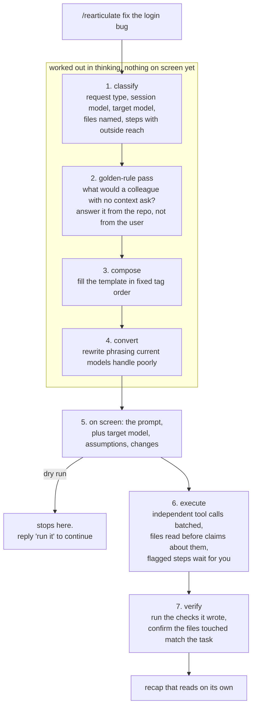
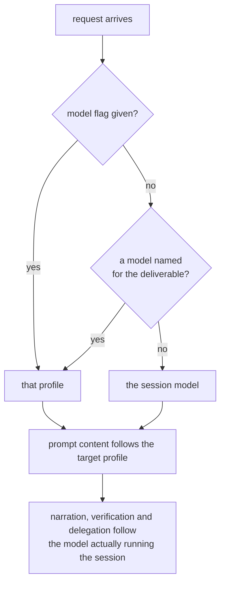
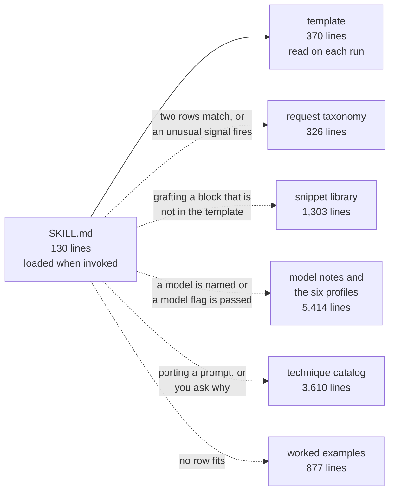

# Rearticulate

**A skill for Claude Code that rewrites your request into a prompt worth running, shows you the rewrite, then runs it.**

Good prompting is mostly a set of habits: say what the output should look like, explain why the task matters, keep data separate from instructions, write down what would count as finished. The habits are documented. Holding to them request after request is the part that slips.

This moves them into the tool. You type a short request, the skill reconstructs the prompt a careful colleague would have written, puts it on screen with the assumptions it had to make, and then carries it out in the same turn. There is nothing to copy and paste, because the prompt is addressed to Claude itself.

## See it work

Four words in:

```
/rearticulate fix the login bug
```

What comes back, before any file is touched:

```xml
<rearticulated_prompt>
<role>You are a senior software engineer specializing in debugging authentication code in this repository.</role>

<context>The user reported a login bug without naming a file or a symptom. The user will review and commit
the diff, so the change must be small and traceable to a reproduced failure, and the existing tests are the
acceptance check. Environment: Claude Code on Windows; repository conventions in CLAUDE.md apply.</context>

<task>Posture: act. Make the change described below.
1. Locate the login path: search the repository for login, authenticate and sign-in handlers, and list the
   tests that exercise them.
2. Reproduce: run those tests. If they pass, check git log for recent changes on the path and the
   conversation for an error message. The reproduced failure defines the bug.
3. Read every file on the path before forming a hypothesis, and identify the root cause rather than the
   first symptom.
4. Apply the smallest edit that fixes the root cause.
5. Re-run the tests from step 2.
If step 2 finds no failure and no report, make no edit; report what was searched and ask the one question
that would identify the bug.</task>

<constraints>Change only the code the reproduced failure requires, because the reviewer will read the diff
against that failure. It is unacceptable to remove or edit tests because this could lead to missing or
buggy functionality.
<keep_changes_to_task>gist: report pre-existing bugs and unmentioned behaviour as follow-ups; commit tests
only where asked or conventional; implement every requested behaviour completely.</keep_changes_to_task></constraints>

<output_format>Prose in this order: the reproduced failure (test name and the error line in a code block),
the root cause in one or two sentences, the change by file path, the test result after the change,
follow-ups noticed but not made.</output_format>

<success_criteria>The test that failed in step 2 passes; every other test in the same suite still passes;
git diff touches only the files named in the reply; the reply names the root cause.</success_criteria>

<execution_guidance>
  <progress_updates_line>…</progress_updates_line>
  <investigate_before_answering>…</investigate_before_answering>
  <targeted_edits>…</targeted_edits>
  <temp_file_cleanup>…</temp_file_cleanup>
  <batch_nudge>…</batch_nudge>
</execution_guidance>

<verification>Before you finish, verify your answer against: the reproduced test passes and the rest of its
suite passes; git status lists only the intended files; no scratch files remain.</verification>
</rearticulated_prompt>
```

```
Reading: act; "the login bug" is whatever the tests or the latest error report expose; confirm before: none
Assumed: the fix stays inside the login module; tests committed only where this repo already keeps them
Changed: nothing stripped from the request
```

Read what that bought. The request named no file, so the prompt searches instead of guessing. It fixes the acceptance check before writing code. It rules out the shortcut of editing a test to make it pass. It says what to do when the bug turns out not to exist, which is where a four-word request usually produces an invented answer. The assumption lines are the part worth reading, since anything inferred shows up there rather than inside the work.

Blocks longer than a few lines appear collapsed on screen, as `…` above. The full text still governs the run.

## How a run works



Steps 1 through 4 cost you nothing to read, because they happen in thinking. Step 5 is the review point.

Questions get different treatment from instructions. "Can you suggest improvements to this file", with no other signal, produces an assessment and leaves your files alone. An imperative with a target produces the change.

## The same request, two models

Prompting advice is measured on particular models, and the measurements disagree.

Opus 5 checks its own work, so telling it to verify buys a redundant pass. Sonnet 5 reads instructions literally and does not stretch a rule from one case to the next, so a rule meant to apply widely needs its scope written out. Sonnet 5 also rejects a non-default `temperature` with a 400, and its tokenizer produces roughly 30 percent more tokens for the same text, so an inherited `max_tokens` can truncate. Fable 5 can decline a request that asks it to narrate its reasoning.

A skill that flattened those differences would hand the same prompt to each of them. Here is what changes when one request is retargeted:

```
/rearticulate write a system prompt for our support bot on claude-opus-5 …
/rearticulate same bot but for --model sonnet-5
```

| | Opus 5 | Sonnet 5 |
|---|---|---|
| Verification section | left out, its checks move into the success criteria | present |
| Length control | `o5_conciseness`, with `tone_preference` closing the prompt | `s5_conciseness` |
| Correction narration | constrained, since this model narrates corrections readily | not applicable |
| Rule scope | stated once | restated per rule, since rules do not generalise here |
| Sampling parameters | flagged against the migration guide | removed, a non-default value returns a 400 |
| `max_tokens` | pinned | pinned with headroom for the tokenizer |
| Thinking | on by default, disabled only at effort high or below | adaptive by default, off with `{type: "disabled"}` |

The substance of the prompt survives the move. The model-specific parts get re-derived rather than carried across, effort included.



Those two dimensions stay separate on purpose. Authoring a prompt for Opus 5 from a Fable 5.1 session leaves the verification tag out of the deliverable while the session still runs its own checks.

A model mentioned in passing does not switch anything. "Fix the test that Sonnet 5 wrote yesterday" keeps the session model. "Rewrite this prompt for Sonnet 5" switches it.

| Profile | Covers |
|---|---|
| `fable-5-1` | Fable 5.1, Mythos 5.1 |
| `fable-5` | Fable 5, Mythos 5 |
| `opus-5` | Opus 5 |
| `sonnet-5` | Sonnet 5 |
| `opus-4-8` | Opus 4.8 |
| `legacy-4x` | Opus 4.7, 4.6, 4.5, Sonnet 4.6, 4.5, Haiku 4.5, Mythos Preview, by analogy with the closest page |

## What it takes off your hands

| Without it | With it |
|---|---|
| A short request gets a plausible guess | What a colleague would ask gets answered from the repository first, and the one question tools cannot settle waits until the end of a turn that already delivered the rest |
| "Can you take a look" turns into edits you did not ask for | Questions produce an assessment; imperatives produce changes |
| A tip measured on one model gets applied to another | Each family has its own profile, and a borrowed snippet is recorded as borrowed |
| A bug fix arrives with tidied imports and a new helper | Pre-existing bugs and nearby improvements come back as follow-ups |
| Confident claims about a file nobody opened | Files named in the request get read before anything is said about them |
| "Done" with nothing behind it | The prompt writes checks, the run executes them, and the recap separates what was verified from what was inferred |

## Install

```bash
git clone https://github.com/AbdallaElzedy/rearticulate.git ~/.claude/skills/rearticulate
```

Windows PowerShell:

```powershell
git clone https://github.com/AbdallaElzedy/rearticulate.git "$env:USERPROFILE\.claude\skills\rearticulate"
```

To scope it to one repository, clone into that repository's `.claude/skills/` directory instead. Claude Code picks it up next session and `/rearticulate` becomes available. There is nothing to configure and no dependencies.

## Use

```
/rearticulate fix the login bug
/rearticulate --model opus-5 write a system prompt for our support bot
/rearticulate --dry-run migrate the probe suite to the new CLI
```

| Flag | Effect |
|---|---|
| `--model <alias>` | Writes the prompt for the named model rather than the session model. Takes `fable-5-1`, `fable-5`, `opus-5`, `sonnet-5`, `opus-4-8`, the 4.x names, and their `claude-` forms. |
| `--dry-run` | Stops after the prompt, with collapsed blocks printed in full so you can take them elsewhere. Replying "run it" executes what was shown. |

Phrasing reaches the same place. "Just rewrite the prompt" or "show me the prompt" reads as a dry run, while a prohibition inside the task, such as "build it but hold off on the tests", stays part of the task.

## What it knows, and when it reads it

`SKILL.md` is 130 lines. The other 12,000 wait until a run reaches for them.



That shape is deliberate. Claude Code holds an invoked skill in context and carries part of it through compaction, so the procedure belongs in the short file and the reference material belongs behind a trigger.

Rule identifiers run through the whole set. `BP-nnn` points into the main guide in reading order, and `F51-`, `F5-`, `O5-`, `S5-` and `O48-` point into the model pages. If you want to know why the skill does something, follow the identifier to the quoted source.

### Sources

Six pages of Anthropic's documentation, captured on 8 September 2026.

- [Prompting best practices](https://platform.claude.com/docs/en/build-with-claude/prompt-engineering/claude-prompting-best-practices)
- [Prompting Claude Fable 5.1](https://platform.claude.com/docs/en/build-with-claude/prompt-engineering/prompting-claude-fable-5-1)
- [Prompting Claude Fable 5](https://platform.claude.com/docs/en/build-with-claude/prompt-engineering/prompting-claude-fable-5)
- [Prompting Claude Opus 5](https://platform.claude.com/docs/en/build-with-claude/prompt-engineering/prompting-claude-opus-5)
- [Prompting Claude Sonnet 5](https://platform.claude.com/docs/en/build-with-claude/prompt-engineering/prompting-claude-sonnet-5)
- [Prompting Claude Opus 4.8](https://platform.claude.com/docs/en/build-with-claude/prompt-engineering/prompting-claude-opus-4-8)

Quoted blocks keep the published wording and punctuation, including the capitalised emphasis a few of them use. A snippet that gets pasted into a prompt should match the text that was measured, not a tidied version of it.

Model behaviour moves between releases. The capture date above is the moment these notes describe, so check the current pages before leaning on a claim about a specific model.

## Repository layout

| Path | Lines | Contents |
|---|---|---|
| `SKILL.md` | 130 | The procedure, the model delta table, and the rules that stay in force for the session |
| `references/technique-catalog.md` | 3610 | The rules from the main guide, each with its quote, the situation it applies to, and the step that uses it |
| `references/snippet-library.md` | 1303 | Sample prompts reproduced as published, with notes on which profiles should receive them |
| `references/models/` | 5181 | One file per profile: identity facts, behavioural entries, what to add, what to take out |
| `references/model-notes.md` | 233 | The router. Aliases, the baseline chain between models, cross-model API facts |
| `references/request-taxonomy.md` | 326 | Request types, the signals that select one, and the conversion list for weak phrasing |
| `templates/rearticulated-prompt.md` | 370 | Tag order, per-tag rules, model overlays, default blocks |
| `examples/rearticulations.md` | 877 | Nine worked rewrites, from a one-line bug fix through a long migration |

## Scope and known gaps

Worth knowing before you rely on it.

The build ran two rounds of adversarial review out of three. The first raised 144 findings and the second brought that to roughly 50, with the structural checks passing. A repair pass then applied 42 edits that a third round would have re-examined, so those rest on one reading rather than an independent one. If something is wrong, that is the likeliest neighbourhood.

The worked examples use stand-in subjects: a login bug, a report renderer, three business documents, a spoken summary, a probe migration, three prompt-authoring requests. A few paths and tool names read as placeholders because that is what they are.

On what it touches: the skill reads files and edits the workspace without stopping to ask, and holds back on steps with outside reach. Pushing code, writing to shared systems, deleting, and sending messages wait for you.

The procedure assumes Claude Code. The prompt-authoring path produces prompts for the API, while the skill itself leans on Claude Code features, among them skill loading, `${CLAUDE_SKILL_DIR}` substitution, and the permission model.

## Changing it

The two files most worth editing are the request taxonomy, where a row describes a kind of request and what it needs, and the examples, which the skill pattern-matches against when no row fits. Both are plain Markdown.

If you add a rule, give it an identifier and a source. The audit trail is what makes the catalog useful rather than merely long. If you add a snippet, record which profiles should receive it and which should not, since a snippet measured on one model is not evidence about another.

Issues and pull requests are welcome, particularly from anyone who has run it against a model the profiles cover thinly.

## Licence

MIT, in [LICENSE](LICENSE). Passages quoted from Anthropic's documentation remain theirs and are attributed to their source page.
